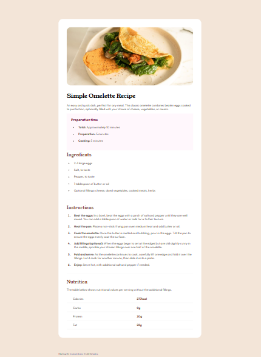

# Frontend Mentor - Recipe Page Solution

This is my solution to the [Recipe Page Challenge](https://www.frontendmentor.io/challenges/recipe-page-KiTsR8QQKm) on Frontend Mentor.

The project focuses on creating a clean, responsive recipe page while practicing semantic HTML, CSS layout, typography, spacing, and responsive design.

## Overview

### The Challenge

The goal was to build a recipe page that closely matches the provided desktop and mobile designs.

The page includes:

* A recipe image and introduction.
* Preparation time information.
* Ingredients and instructions.
* Nutrition information.
* Responsive layouts for different screen sizes.

### Screenshot

### Links

* **Solution URL:** https://www.frontendmentor.io/solutions/your-solution-link
* **Live Site URL:** https://your-live-site-url.com

---

## My Process

### Built With

* Semantic HTML5
* CSS3
* Flexbox
* Responsive design
* Google Fonts

---

### What I Learned

This project helped me improve my understanding of structuring longer pages and maintaining consistent styling across different sections.

Some of the concepts I practiced include:

* Using semantic HTML elements to organize the recipe content.
* Creating responsive layouts for desktop and mobile screens.
* Managing spacing and typography consistently.
* Styling lists for ingredients and instructions.
* Creating structured sections for preparation time and nutrition information.
* Using CSS to closely match a provided design.

---

### Continued Development

For future projects, I want to continue improving:

* Responsive design and media queries.
* CSS Flexbox and Grid.
* Semantic HTML and accessibility.
* Typography and spacing systems.
* Writing cleaner and more maintainable CSS.
* Recreating designs more accurately from screenshots.

---

### AI Collaboration

I used Gemini as a learning and debugging assistant during this project.

* **Tool used:** Gemini
* **How I used it:**

  * Helped debug HTML and CSS issues.
  * Clarified CSS layout and responsive design concepts.
  * Discussed ways to structure different sections of the page.
* **What worked well:**

  * Helped identify layout problems and understand why they occurred.
  * Made it easier to troubleshoot CSS while still implementing the project myself.

I used AI primarily for guidance, debugging, and learning rather than having it generate the complete project.

---

## Author

* **Frontend Mentor:** https://www.frontendmentor.io/profile/yourusername
* **GitHub:** https://github.com/yourusername

---

## Acknowledgments

Thanks to [Frontend Mentor](https://www.frontendmentor.io/) for providing realistic frontend challenges that make it possible to practice HTML and CSS by recreating real-world interfaces.
